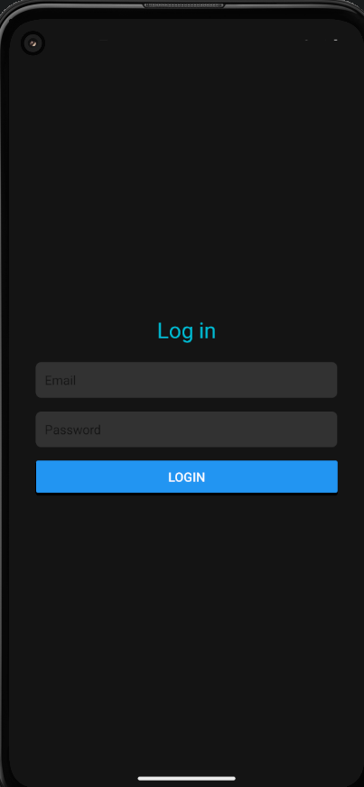
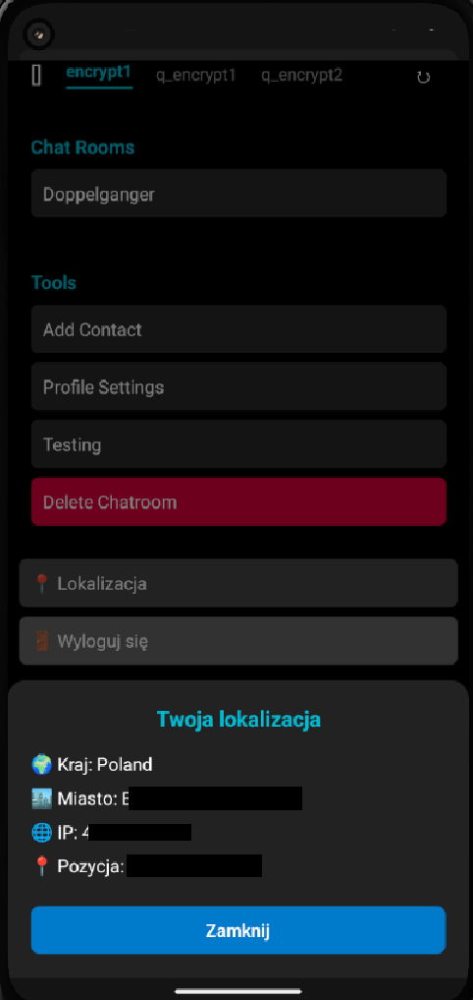
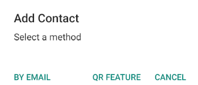
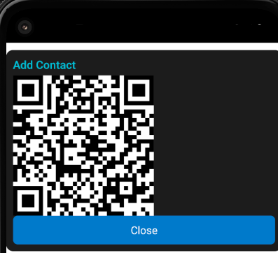
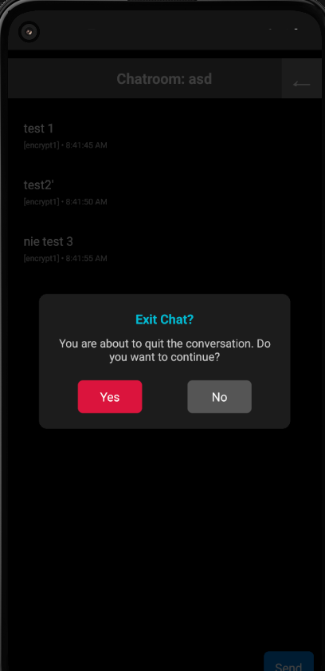
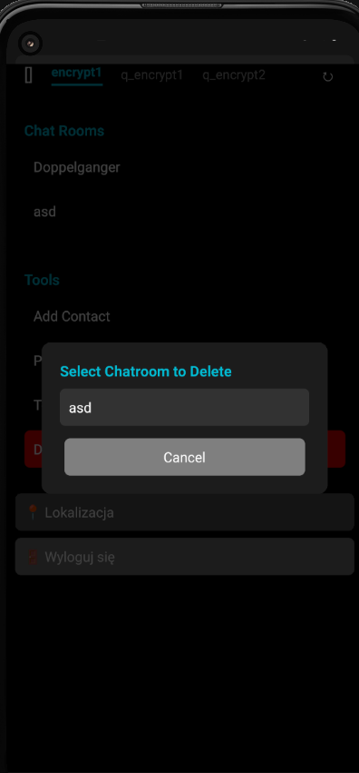
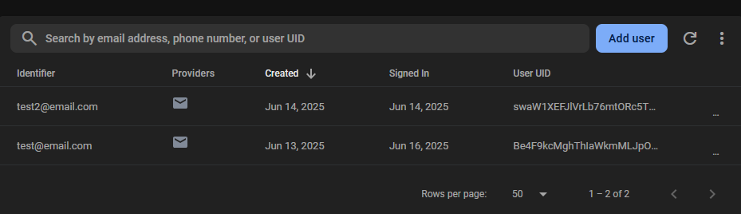
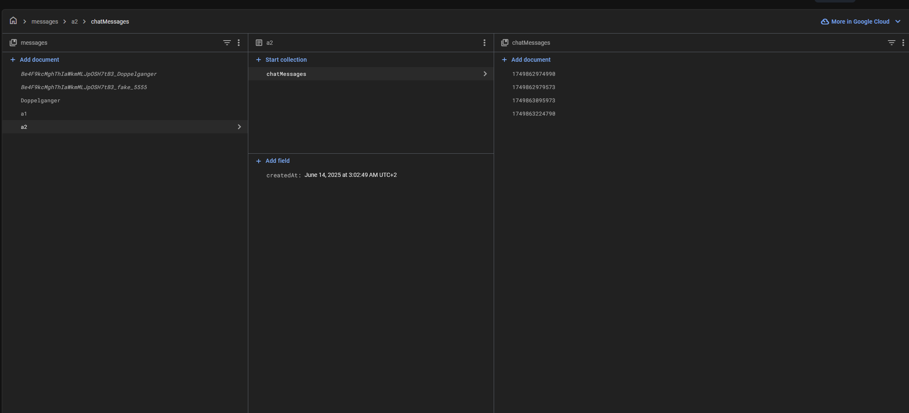

# Komunikator React Native + Web (PWA)

Aplikacja komunikacyjna umożliwiająca bezpieczne przesyłanie wiadomości, zarządzanie kontaktami i integrację z usługami lokalizacji. Projekt został przygotowany z myślą o multiplatformowym działaniu – natywnie na urządzeniach mobilnych oraz jako Progressive Web App w przeglądarce.

Pełna galeria zrzutów ekranu znajduje się na końcu pliku README.

## Kluczowe funkcje

- **Logowanie i rejestracja** za pomocą Firebase Authentication, z weryfikacją adresu e-mail i obsługą kont użytkowników.
- **Lista kontaktów** z możliwością dodawania za pomocą e-mail lub kodów QR.
- **Czat indywidualny** z mechanizmem wstępnego szyfrowania oraz zapisem historii wiadomości w pamięci urządzenia.
- **Obsługa lokalizacji użytkownika** poprzez publiczne API.
- **Panel profilu** pozwalający edytować podstawowe dane oraz klucz publiczny.
- **Generowanie i skanowanie kodów QR** do szybkiej wymiany kontaktów.
- **Tryb offline** (cache danych lokalnych) oraz automatyczna synchronizacja po odzyskaniu połączenia.
- **Responsywny interfejs PWA**, dostosowujący układ do rozdzielczości ekranu.
- **Możliwość instalacji jako aplikacja desktopowa PWA**.

## Technologie

- React Native (Android, iOS)
- React Native Web (PWA)
- Firebase Authentication
- Firebase Firestore (struktura danych i synchronizacja)
- AsyncStorage
- react-native-camera
- react-native-qrcode-svg
- ip-api.com

## Możliwości rozwoju

W kolejnych etapach planowane jest:

- Implementacja pełnego szyfrowania end-to-end dla czatów.
- Rozbudowa powiadomień push o wsparcie dla statusów online.
- Wprowadzenie grupowych konwersacji i zaawansowanego zarządzania kontaktami.

## Uruchamianie projektu

### Android / iOS

1. Instalacja zależności:
npm install

2. Uruchomienie serwera Metro:

npx react-native start

3. W nowym terminalu uruchomienie aplikacji:
Uwaga: Projekt korzysta z wariantów budowania (flavors).
Nie używaj:

npx react-native run-android

Tylko uruchom:

npx react-native run-android --variant=generalDebug

> *Upewnij się, że emulator Android Studio jest uruchomiony przed wykonaniem ostatniego polecenia.*

---

## Zrzuty ekranu 

Poniżej przykładowe ekrany aplikacji w kolejności odpowiadającej typowemu scenariuszowi użytkownika.

---

### Ekran logowania

> Podstawowy ekran logowania z obsługą uwierzytelniania użytkownika przez Firebase Authentication.

---

### Panel główny i pobieranie lokalizacji

> Poniższy zrzut ekranu przedstawia główny panel aplikacji oraz komponent wyświetlający lokalizację użytkownika pobraną z publicznego API.
> Dane lokalizacyjne zostały częściowo zamaskowane w celach prywatności.

---

### Wybór metody dodania kontaktu

---

### Generowanie kodu QR do dodania kontaktu

---

### Potwierdzenie opuszczenia czatu

> Okno dialogowe wyświetlane podczas próby opuszczenia aktywnej konwersacji. Użytkownik może potwierdzić lub anulować akcję.

---

### Usuwanie pokoju czatu

> Okno dialogowe umożliwiające wybór pokoju czatu do usunięcia.

---

### Firebase Authentication – panel użytkowników

> Lista testowych kont użytkowników zarejestrowanych za pomocą Firebase Authentication w środowisku deweloperskim.

---

### Firestore (prototyp)

> Poniższy zrzut ekranu pokazuje prototypową konfigurację Firestore, przygotowaną na etapie wstępnych testów integracji.
> W obecnej wersji projektu funkcja synchronizacji nie została jeszcze zaimplementowana.

